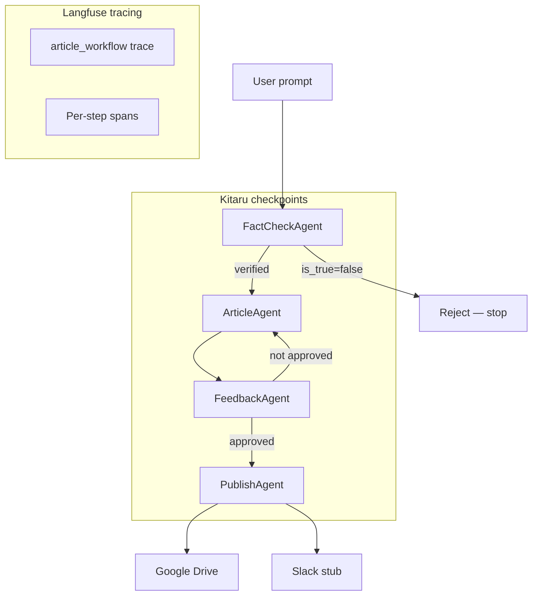

# AgentFlow

A multi-agent article pipeline that fact-checks a topic, drafts content, runs an automated review loop, and publishes approved articles to Google Drive — with **durable checkpoints** ([Kitaru](https://docs.zenml.io/kitaru)) and **end-to-end tracing** ([Langfuse](https://langfuse.com)).

```
User prompt → FactCheck → Write → Review ⇄ Revise (up to 3×) → Publish → Google Drive
```

## Why this project

Most agent demos are a single chatbot. AgentFlow models a **production-style content workflow**:

- **Specialized agents** with typed Pydantic contracts between steps
- **Quality gate** — nothing publishes until a feedback agent approves the draft
- **Durability** — Kitaru checkpoints let you replay from a failed step without re-running expensive LLM calls
- **Observability** — Langfuse traces every agent run and pipeline step

## Architecture



## Agents

| Agent | Role |
|-------|------|
| **FactCheckAgent** | Verifies the claim via web search (Wikipedia, official sources). Rejects unverifiable topics. |
| **ArticleAgent** | Writes a draft using verified evidence and fact-check references. |
| **FeedbackAgent** | Reviews the draft for accuracy, clarity, and completeness. |
| **PublishAgent** | Uploads to Google Drive and announces via Slack (stub). |

Structured data flows between agents via Pydantic models in `models/schemas.py`.

## Tech stack

- **[Pydantic AI](https://ai.pydantic.dev/)** — agent framework with structured outputs and web search
- **[Kitaru](https://docs.zenml.io/kitaru)** — durable execution, checkpointing, and replay
- **[Langfuse](https://langfuse.com)** — LLM observability and tracing
- **Google Drive API** — OAuth user flow, native Google Docs
- **OpenAI** — `gpt-4.1-mini` via Pydantic AI

## Project structure

```
AgentFlow/
├── agents/              # Pydantic AI agents (fact-check, article, feedback, publish)
├── integrations/        # Google Drive, Langfuse, Slack
├── models/              # Pydantic schemas shared between agents
├── prompts/             # System prompts for each agent
├── workflow.py          # Kitaru @checkpoint steps + @flow orchestration
├── app.py               # Entry point
└── config.py            # Environment and credential loading
```

## Prerequisites

- Python 3.11+
- [OpenAI API key](https://platform.openai.com/api-keys)
- Google Cloud project with **Google Drive API** enabled and an **OAuth Desktop** client (for publishing)
- Optional: [Langfuse](https://cloud.langfuse.com) project for tracing

## Quick start

```bash
# Clone and enter the repo
git clone https://github.com/memona008/agentic-article-pipeline.git
cd agentic-article-pipeline

# Create virtual environment
python3 -m venv .venv
source .venv/bin/activate

# Install dependencies
pip install -r requirements.txt

# Initialize Kitaru (local stack)
kitaru init

# Configure environment
cp .env.example .env
# Edit .env and set OPENAI_API_KEY

# Run the pipeline
python app.py
```

On first publish, a browser window opens for Google OAuth. The token is saved to `token.json` (gitignored).

## Configuration

Copy `.env.example` to `.env`:

| Variable | Required | Description |
|----------|----------|-------------|
| `OPENAI_API_KEY` | Yes | OpenAI API key for all agents |
| `LANGFUSE_PUBLIC_KEY` | No | Langfuse public key |
| `LANGFUSE_SECRET_KEY` | No | Langfuse secret key |
| `LANGFUSE_BASE_URL` | No | Langfuse host (default: `https://cloud.langfuse.com`) |
| `GOOGLE_CREDENTIALS_FILE` | For publish | Path to OAuth client JSON (default: `./credentials.json`) |
| `GOOGLE_TOKEN_FILE` | For publish | Path to saved OAuth token (default: `./token.json`) |

Langfuse is optional — the workflow runs without it; tracing is simply skipped.

## Google Drive setup

1. Go to [Google Cloud Console](https://console.cloud.google.com/)
2. Create a project and enable **Google Drive API**
3. Configure the **OAuth consent screen** (set user type to **External** if you are not in the same org as the client)
4. Create **OAuth client ID** → Application type: **Desktop app**
5. Download the JSON and save it as `credentials.json` in the project root
6. Run `python app.py` — complete the browser OAuth flow on first publish

> **Note:** If you see `Error 403: org_internal`, your OAuth client is restricted to internal users. Change the user type to External in the consent screen, or use an account within the allowed organization.

## Kitaru: replay and durability

Each pipeline step is a Kitaru checkpoint. If publish fails, replay from that step without re-running fact-check or write:

```bash
# List past executions
kitaru executions list

# Replay from a specific checkpoint
kitaru executions replay <execution-id> --from step_publish_article
```

Cached checkpoints are reused on subsequent runs (you'll see `cached` in the logs).

## Observability

With Langfuse keys in `.env`, the pipeline emits:

- A root `article_workflow` trace
- Per-step spans: `fact_check`, `write_article`, `review_article`, `publish_article`
- Automatic instrumentation of all Pydantic AI agent runs

View traces in your [Langfuse dashboard](https://cloud.langfuse.com).

## Design decisions

- **Typed contracts** — `FactCheckResult`, `ArticleDraft`, `FeedbackResult`, and `PublishResult` keep agent boundaries explicit and debuggable.
- **Feedback loop** — minimum 1 review, maximum 3 revision rounds; publishing only happens after approval.
- **Checkpoint boundaries** — one checkpoint per agent step so replay granularity matches business logic.
- **Integrations as tools** — publish agent calls Google Drive and Slack via Pydantic AI tools, keeping side effects out of orchestration code.

## Current limitations

- **Slack** is stubbed (`integrations/slack.py` logs to console). Google Drive upload is fully implemented.
- **Publishing requires approval** — if feedback never approves after 3 rounds, the pipeline stops without publishing.

## License

MIT — see [LICENSE](LICENSE).
